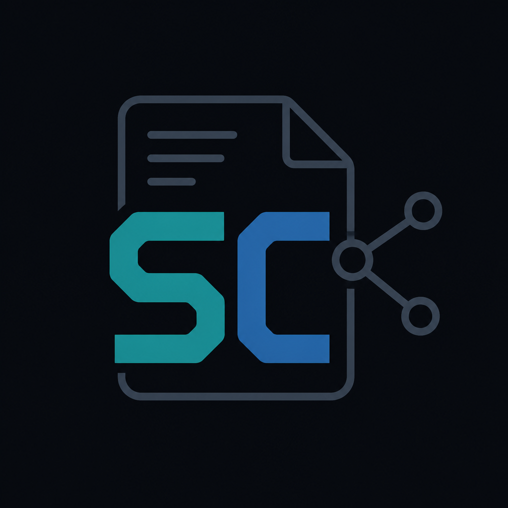
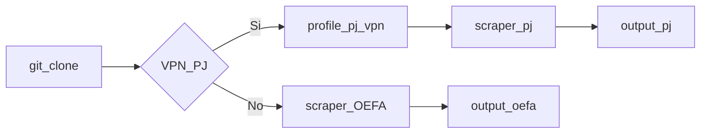

<div align="center">



# scraper-challenge

<p>
  
</p>

[](https://www.typescriptlang.org/)
[](https://nodejs.org/)
[](https://docs.docker.com/compose/)
[](LICENSE)

**Scraper HTTP en TypeScript** para jurisprudencia del Poder Judicial (PJ) y el Repositorio Digital de OEFA.

Sin navegador · Docker-first · PDFs por defecto en demos

[📦 Clonar](#3-obtener-el-código) · [🔐 Camino A · PJ + VPN](#5-camino-a--desafío-con-vpn-pj) · [🌐 Camino B · OEFA](#6-camino-b--probar-sin-vpn-oefa) · [⚙️ Parámetros](#8-parámetros-del-scraper)

</div>

---

## 📋 Índice

1. [📌 Resumen](#1-resumen)
2. [✅ Requisitos](#2-requisitos)
3. [📦 Obtener el código](#3-obtener-el-código)
4. [⚡ Inicio rápido](#4-inicio-rápido)
5. [🔐 Camino A — Desafío con VPN (PJ)](#5-camino-a--desafío-con-vpn-pj)
6. [🌐 Camino B — Probar sin VPN (OEFA)](#6-camino-b--probar-sin-vpn-oefa)
7. [📁 Dónde están los resultados](#7-dónde-están-los-resultados)
8. [⚙️ Parámetros del scraper](#8-parámetros-del-scraper)
9. [🔧 Problemas frecuentes](#9-problemas-frecuentes)
10. [💻 Ejecutar sin Docker (solo OEFA)](#10-ejecutar-sin-docker-solo-oefa)
11. [📂 Estructura del código](#11-estructura-del-código)
12. [📄 Licencia](#12-licencia)

---

## 📌 1. Resumen

Consulta dos portales del Estado peruano por **HTTP** (axios + cheerio; sin Puppeteer/Playwright) y guarda listados + PDFs en archivos.

| Sitio | Qué descarga | ¿Necesitas VPN? |
|-------|--------------|-----------------|
| 🇵🇪 **PJ** — Jurisprudencia del Poder Judicial | 📄 Listado + PDFs | 🔐 **Sí** (salida de red desde Perú) |
| 🌿 **OEFA** — Repositorio Digital | 📄 Listado + PDFs | ✅ **No** |

El objetivo del desafío es **PJ**. OEFA sirve para comprobar que el scraper funciona sin VPN.

**Forma recomendada de ejecutarlo:** Docker Compose. No hace falta instalar Node.js en tu máquina.



---

## ✅ 2. Requisitos

| Herramienta | Uso |
|-------------|-----|
| [Docker](https://docs.docker.com/engine/install/) con **Compose v2** (`docker compose`, con espacio) | Camino oficial |
| Archivos en `vpn/` | Ya incluidos (perfil OpenVPN, certificado y credenciales de prueba para PJ) |

Comprueba que Docker responde:

```bash
docker --version
docker compose version
```

Si alguno de esos comandos falla, instala o actualiza Docker antes de seguir.

---

## 📦 3. Obtener el código

```bash
git clone https://github.com/tradermoyano-cloud/scraper-challenge.git
cd scraper-challenge
```

Todos los comandos de este documento se ejecutan **desde esa carpeta**.

| Enlace | URL |
|--------|-----|
| Repositorio | `https://github.com/tradermoyano-cloud/scraper-challenge.git` |
| Clone HTTPS | `git clone https://github.com/tradermoyano-cloud/scraper-challenge.git` |

---

## ⚡ 4. Inicio rápido

| Objetivo | Comando |
|----------|---------|
| 🔐 **A · PJ (desafío)** | Ver [Camino A](#5-camino-a--desafío-con-vpn-pj) |
| 🌐 **B · OEFA (sin VPN)** | `docker compose run --rm scraper` |

**Demo por defecto (ambos caminos):** 1 página · máximo 2 documentos · **con PDFs** · delay acotado.

---

## 🔐 5. Camino A — Desafío con VPN (PJ)

El portal del Poder Judicial suele rechazar conexiones desde fuera de Perú. Por eso este camino levanta un contenedor VPN (TunnelBear, perfil Perú) y hace que el scraper salga por esa red.

Los archivos de `vpn/` ya vienen en el repo; **no** hace falta crear cuentas ni editar credenciales para la demo.

### 🟢 Paso 1 — Encender la VPN

```bash
docker compose --profile pj up -d vpn
```

`--profile pj` activa los servicios del desafío PJ (VPN + scraper con VPN). `-d` los deja en segundo plano.

Sigue los logs hasta que la VPN termine de conectar:

```bash
docker logs -f scraper-challenge-vpn-1
```

Cuando aparezca la línea `Initialization Sequence Completed`, la VPN está lista. Pulsa **Ctrl+C**: solo dejas de ver los logs; el contenedor **sigue encendido**.

### ▶️ Paso 2 — Ejecutar el scraper PJ

```bash
docker compose --profile pj run --rm scraper-pj
```

Qué hace por defecto: **demo acotada** — sitio PJ, 1 página, máximo 2 documentos, **con descarga de PDFs**, pausa de 1500 ms entre peticiones. No es un límite del scraper; solo un preset rápido (cupo VPN / entrega corta).

### Ampliar o cambiar la búsqueda

Con la VPN encendida (Paso 1), sustituye el comando por defecto y pasa los flags que necesites:

```bash
# Más páginas y documentos
docker compose --profile pj run --rm --entrypoint npm scraper-pj run scrape -- \
  --site pj --max-pages 5 --max-docs 20 --pdfs --delay 1500
```

```bash
# Sin tope de páginas ni documentos (recorre el listado hasta el final; puede tardar y gastar cupo VPN)
docker compose --profile pj run --rm --entrypoint npm scraper-pj run scrape -- \
  --site pj --pdfs --delay 1500
```

Filtros de búsqueda y el resto de opciones: [sección 8](#8-parámetros-del-scraper).

### 📂 Paso 3 — Revisar la salida

```bash
ls -lt output/
```

Busca la carpeta más reciente que empiece por `pj-`. Luego:

```bash
cat output/pj-<fecha>/summary.json
ls output/pj-<fecha>/pdfs/
```

Sustituye `pj-<fecha>` por el nombre real de la carpeta.

### 🛑 Paso 4 — Apagar la VPN

```bash
docker compose --profile pj down
```

Detalle técnico del perfil OpenVPN: [`vpn/README.md`](vpn/README.md).

---

## 🌐 6. Camino B — Probar sin VPN (OEFA)

Úsalo para verificar que el entorno funciona. **No** enciendas la VPN ni uses el profile `pj`.

### ✨ Qué hace el comando por defecto

**Demo acotada** OEFA: 1 página, máximo 2 documentos, **con descarga de PDFs**, pausa de 600 ms entre peticiones.

### 📝 Pasos

1. ▶️ Ejecuta:

```bash
docker compose run --rm scraper
```

La primera vez Docker construye la imagen; puede tardar unos minutos.

2. 📂 Mira qué se creó:

```bash
ls -lt output/
```

Debes ver una carpeta cuyo nombre empieza por `oefa-` (por ejemplo `oefa-2026-08-10T12-00-00-000Z`).

3. 📄 Abre el resumen y los PDFs:

```bash
cat output/oefa-<fecha>/summary.json
ls output/oefa-<fecha>/pdfs/
```

Sustituye `oefa-<fecha>` por el nombre exacto que mostró `ls`. En el JSON, `documentsExtracted` debería ser mayor que `0`.

---

## 📁 7. Dónde están los resultados

Cada ejecución crea una carpeta nueva:

```text
output/<sitio>-<fecha-hora>/
├── documents.jsonl    # un documento por línea (JSON)
├── summary.json       # totales de la corrida
├── pdfs/              # PDFs descargados
└── failed-pdfs.json   # PDFs que no se pudieron descargar
```

Ejemplos: `output/oefa-2026-08-10T09-50-17-637Z/`, `output/pj-2026-08-10T09-51-31-157Z/`.

| Archivo o carpeta | Contenido |
|-------------------|-----------|
| `documents.jsonl` | Un documento por línea (JSON): metadatos extraídos del listado |
| `summary.json` | Totales de la corrida (documentos, PDFs, errores, etc.) |
| `pdfs/` | PDFs descargados en la corrida |
| `failed-pdfs.json` | Lista de PDFs que no se pudieron descargar (por ejemplo por error 429) |

Para listar corridas de más reciente a más antigua: `ls -lt output/`.

---

## ⚙️ 8. Parámetros del scraper

El programa se invoca así (dentro de Docker o con Node):

```text
npm run scrape -- [opciones]
```

| Parámetro | Qué controla | Valor por defecto | Notas |
|-----------|--------------|-------------------|--------|
| `--site pj` o `--site oefa` | Qué portal consultar | `oefa` | `pj` requiere VPN (Camino A) |
| `--max-pages <n>` | Cuántas páginas del listado recorrer como máximo | sin límite | `<n>` = **entero ≥ 1** (ej. `1`…`10`). Omitir = sin tope |
| `--max-docs <n>` | Cuántos documentos guardar como máximo | sin límite | `<n>` = **entero ≥ 1** (ej. `2`…`20`). Independiente de las páginas: corta al llegar a ese número |
| `--pdfs` | Descarga el PDF de cada documento | sí (activo) | Flag booleano (sin número); comportamiento por defecto de la entrega |
| `--delay <ms>` | Milisegundos de espera entre peticiones HTTP | `800` | `<ms>` = **entero ≥ 0** en milisegundos (ej. `600`, `800`, `1500`). Sube el valor si ves muchos 429 |
| `--retries <n>` | Reintentos cuando el servidor responde 429 u otro error recuperable | `5` | `<n>` = **entero ≥ 1**. Tras agotarlos, el PDF falla y se anota en `failed-pdfs.json` |
| `--out <dir>` | Carpeta donde escribir la salida | `output/<sitio>-<timestamp>` | Ruta relativa al directorio de trabajo |
| `--filter clave=valor` | Filtro de búsqueda del portal (se puede repetir) | ninguno | Texto; en PJ, `anio` suele ser un año (ej. `2020`). Ver claves más abajo |
| `--help` | Muestra la ayuda en consola | — | — |

Donde veas `<n>` o `<ms>`, sustituye por un **número entero** (sin decimales).

### Valores que usan los servicios Docker (sin flags extra)

| Servicio | Comando efectivo | Notas |
|----------|------------------|--------|
| `scraper-pj` (Camino A) | `--site pj --max-pages 1 --max-docs 2 --pdfs --delay 1500` | **Demo acotada**, no el único modo |
| `scraper` (Camino B) | `--site oefa --max-pages 1 --max-docs 2 --pdfs --delay 600` | **Demo acotada** OEFA |

Si omites `--max-pages` y `--max-docs`, no hay tope de listado (el scraper puede seguir hasta agotar resultados).

### Cómo pasar parámetros distintos con Docker

Sustituye el comando por defecto con `--entrypoint npm` y tu lista de flags.

Para PJ, el servicio debe ser `scraper-pj` y el profile `pj` (la VPN debe estar encendida, Paso 1 del Camino A):

```bash
# PJ ampliado (ejemplo)
docker compose --profile pj run --rm --entrypoint npm scraper-pj run scrape -- \
  --site pj --max-pages 5 --max-docs 20 --pdfs --delay 1500
```

```bash
# PJ con texto y año (filtros)
docker compose --profile pj run --rm --entrypoint npm scraper-pj run scrape -- \
  --site pj --max-pages 3 --max-docs 10 --pdfs --delay 1500 \
  --filter q=homicidio --filter anio=2020
```

```bash
# OEFA: 1 página, 2 docs, con PDFs
docker compose run --rm --entrypoint npm scraper run scrape -- \
  --site oefa --max-pages 1 --max-docs 2 --pdfs --delay 600
```

### Filtros `--filter` por sitio

Se pueden repetir: `--filter clave=valor --filter otra=valor`.

#### PJ (`--site pj`)

| Clave | Significado | Ejemplo |
|-------|-------------|---------|
| `q` | Texto libre de búsqueda | `--filter q=homicidio` |
| `anio` | Año de resolución (`buAnio`) | `--filter anio=2020` |
| `corte` | Código de corte (default interno `1`) | `--filter corte=1` |
| `distrito` | Código de distrito (default `0`) | `--filter distrito=0` |
| `especialidad` | Código de especialidad (default `0`) | `--filter especialidad=0` |
| `sala` | Código de sala (default `0`) | `--filter sala=0` |

```bash
# PJ mezclado: texto + año
docker compose --profile pj run --rm --entrypoint npm scraper-pj run scrape -- \
  --site pj --max-pages 3 --max-docs 10 --pdfs --delay 1500 \
  --filter q=homicidio --filter anio=2020
```

```bash
# PJ mezclado: texto + año + códigos de formulario
docker compose --profile pj run --rm --entrypoint npm scraper-pj run scrape -- \
  --site pj --max-pages 3 --max-docs 10 --pdfs --delay 1500 \
  --filter q=homicidio --filter anio=2020 --filter corte=1 --filter distrito=0
```

`corte`, `distrito`, `especialidad` y `sala` son códigos del formulario JSF del portal (no nombres legibles). Si no los conoces, filtra con `q` y `anio`. Para comprobar el año, mira `fechaResolucion` en `documents.jsonl` (no el nombre del PDF).

#### OEFA (`--site oefa`)

| Clave | Significado | Ejemplo |
|-------|-------------|---------|
| `expediente` | Número de expediente | `--filter expediente=123-2020` |
| `administrado` | Nombre del administrado | `--filter administrado=ACME` |
| `unidad` | Unidad orgánica | `--filter unidad=OEFA` |
| `sector` | Sector | `--filter sector=1` |
| `resolucion` | Número o texto de resolución | `--filter resolucion=001-2020` |

```bash
# OEFA mezclado: expediente + sector (ilustrativo)
docker compose run --rm --entrypoint npm scraper run scrape -- \
  --site oefa --max-pages 1 --max-docs 2 --pdfs --delay 600 \
  --filter expediente=123-2020 --filter sector=1
```

### Errores 429 (demasiadas peticiones)

Si el servidor responde `429`, el scraper espera y reintenta hasta `--retries`. Si se agotan los intentos, registra el documento en `failed-pdfs.json` y sigue con el siguiente.

---

## 🔧 9. Problemas frecuentes

| Qué ves | Qué significa | Qué hacer |
|---------|---------------|-----------|
| `AUTH_FAILED` en logs de VPN | Credenciales rechazadas | Revisa `vpn/auth.txt` (email en la línea 1, password en la línea 2) |
| HTTP `403`, scrape vacío o VPN dudosa | La salida puede no estar en Perú | Espera a `Initialization Sequence Completed` y usa el diagnóstico de abajo |
| `ERROR: VPN not configured!` | Falta o está mal el perfil OpenVPN | Debe existir un único `.ovpn` sin espacios en el nombre (p. ej. `vpn/peru.ovpn`) |
| `documentsExtracted: 0` | El listado salió vacío o el portal falló | Vuelve a ejecutar; a veces la respuesta viene vacía |
| No encuentras la carpeta de salida | El nombre incluye fecha/hora exacta | Usa `ls -lt output/` y abre la carpeta concreta; no uses comodines a ciegas |
| Docker pide permisos o no encuentra Compose | Docker no está bien instalado o el usuario no está en el grupo `docker` | Revisa la instalación de Docker Desktop / Engine y Compose v2 |

### Diagnóstico local (solo si falla PJ)

No forma parte del Camino A de entrega. Úsalo en desarrollo si ves `403`, cero documentos o sospechas de la VPN:

```bash
docker compose --profile pj exec vpn sh -c \
  'wget -qO- https://ipinfo.io/country; echo; wget -S --spider https://jurisprudencia.pj.gob.pe/jurisprudenciaweb/faces/page/inicio.xhtml 2>&1 | head'
```

Esperado: línea `PE` y `HTTP/1.1 200`. Si no, revisa `docker logs scraper-challenge-vpn-1` antes de volver a lanzar `scraper-pj`.

---

## 💻 10. Ejecutar sin Docker (solo OEFA)

Necesitas **Node.js 20 o superior** en tu máquina.

```bash
node -v          # debe mostrar v20.x o mayor
npm install
npm run demo:oefa
```

`demo:oefa` equivale a: sitio OEFA, 1 página, 2 documentos, con PDFs, delay 600 ms.

Para PJ, el camino soportado es el **Camino A** (Docker + VPN). No uses Node en el host como criterio de aceptación de PJ.

---

## 📂 11. Estructura del código

```text
src/
  index.ts           Línea de comandos (lee los parámetros)
  scraper.ts         Orquesta paginación, límites y guardado
  http/client.ts     Cliente HTTP con cookies y reintentos ante 429
  sites/pj.ts        Adaptador del portal PJ
  sites/oefa.ts      Adaptador del portal OEFA
  pdf/downloader.ts  Descarga de PDFs
  storage/           Escritura de JSONL y summary
```

---

## 📄 12. Licencia

[MIT](LICENSE) — uso educativo / desafío de scraping. Respeta los términos de uso de cada portal.
